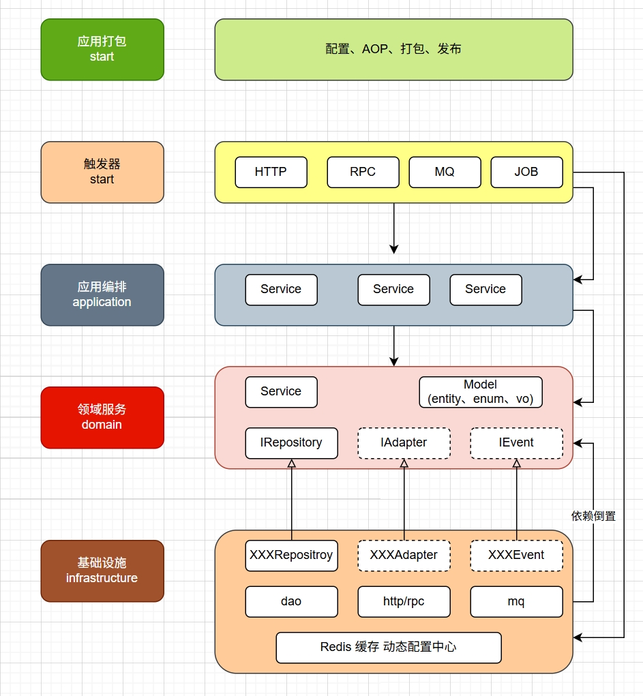

emsp
=============================

emsp项目，mvc2ddd 轻改版，Maven版

## 需求反解

1. 系统以管理员的视角操作账号、卡，实现逻辑自洽。不开放注册。提供管理员登陆入口。不登录不能做任何操作，包括swagger。
2. 账号、卡片修改状态限制激活（Activated）、冻结（Deactivated），账号修改状态联动卡片的冻结、解冻。
3. 提供账号、卡片分页查询（按最后更新时间倒序）

## 技术栈与组件

| 组件      | 技术选型                             | 说明                         |
|---------|----------------------------------|----------------------------|
| 框架      | Spring Boot 3.x                  | 快速构建 RESTful API           |
| 数据库     | MySQL                            |                            |
| ORM     | MyBatisPlus                      |                            |
| 数据校验    | Hibernate Validator              |                            |
| 分页查询    | PageHelper                       | 分页和排序                      |
| 测试      | JUnit 5 + Idea HttpClient Plugin | 单元测试和 API 测试               |
| 容器化     | Docker + Docker Compose          | 本地环境与云部署                   |
| CI/CD   | GitHub Actions                   | 自动化构建、测试、部署                |
| 安全认证与授权 | Spring Security                  | 默认登录行为，基本功能，未做个性化定制，仅为效果演示 |
| 缓存与分布式锁 | Redis                            | redisson                   |

## 架构分层（mvc2ddd）

项目基于MVC分层架构 进行了ddd改造 ，主要分为以下几层：

- trigger层 ：提供接口实现、消息接收、任务执处理。
- Service层 ：应用服务层，编排领域服务。
- domain层（领域层）： 领域服务，定义领域仓储接口、领域模型
- DAO层（基础设施层） ：实现domain层仓储（dip）,负责与数据库交互，使用MyBatis Plus进行数据访问，
    - Configuration ：配置类，如Spring Security配置、Redis配置等。
    - Global ：全局异常处理、统一响应格式等。
    - Common ：公共工具类、异常类、常量等。

## 模块划分

项目采用多模块设计，主要模块包括：

- emsp-start ：启动模块，包含AOP、Configuration等。
- emsp-trigger：触发器模块，一般也被叫做 adapter 适配器层，提供接口实现、消息接收、任务执行
- emsp-dao ： 数据持久化模块，包含MyBatis Plus的Mapper接口、Repository接口，反向依赖domain
- emsp-service ：应用服务模块，依赖domain
- emsp-domain:  领域服务模块，实现核心业务逻辑；领域模型，包含DTO、VO、实体、值对象、枚举、事件等。
- emsp-common ：公共定义模块，包含工具类、异常类、常量等。

## 核心流程

### 请求流程概述

1. 请求入口 ：请求从控制器（如 AccountController ）进入。
2. 应用服务层 ：控制器调用应用服务（如 AccountService ），应用服务编排领域服务（如 AccountDomainService ）处理业务逻辑。
3. 领域服务层 ：执行核心业务逻辑。
4. 基础设施层 ：领域服务通过仓储接口（如 AccountRepository ）访问数据，基础设施层（如 AccountRepositoryImpl ）实现具体的数据访问逻辑。
5. 返回响应 ：处理完成后，返回响应给客户端。

### 安全流程 ：

- 用户登录 → Spring Security进行认证 → 根据角色授权访问资源 → 未授权时触发 CustomAccessDeniedHandler 。

### 异常流程 ：

- 发生异常 → GlobalExceptionHandler 捕获异常 → 返回统一错误响应。

## 架构

## RDBMS 设计

参考 sql 文件夹init.sql

## RESTful API 设计

参数请参考[swagger](http://101.201.46.166:8080/swagger-ui/index.html#/)

| 操作      | HTTP 方法 | 路径                  | 说明                            |
|---------|---------|---------------------|-------------------------------|
| 创建账号    | POST    | /api/accounts       |                               |
| 修改账号状态  | PATCH   | /api/account/status | 只能修改两种状态：activiated,inactived |
| 查询账号及卡片 | GET     | /api/accounts       | PageHelper分页查询，支持email筛选      |
| 创建卡片    | POST    | /api/cards          |                               |
| 修改卡片状态  | PATCH   | /api/card/status    | 只能修改两种状态：activiated,inactived |
| 分配卡     | PATCH   | /api/card/assign    |                               |

## 业务架构设计

1. 多模块： 模块化设计、依赖统一管理 ，灵活扩展
2. 事件驱动
3. 统一响应格式
4. 横切日志，非功能业务、功能业务解耦；
5. 全局异常处理兜底
6. i18n 支持国际化：错误码、验证、swagger
7. 横切缓存，按需注解
8. 权限体系：用户角色分级，细粒度权限控制(方法级)
9. 轻量化ddd 改造

## TODO:

1. more unit tests
2. 战役：设计模式-策略，模板...
